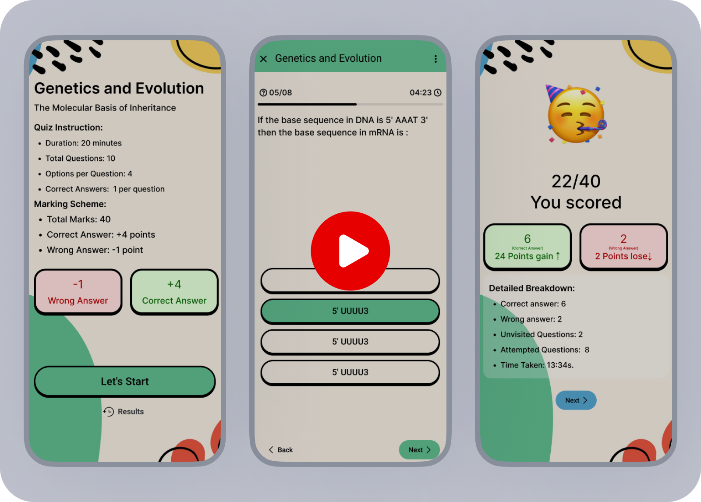
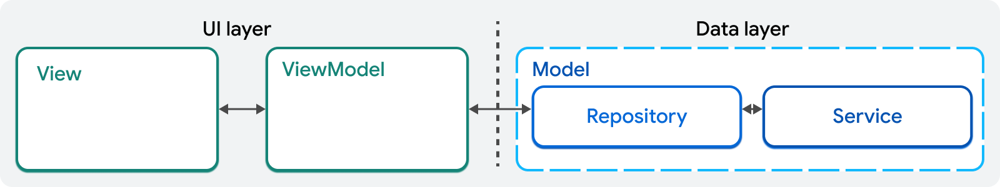

# **Quizzy**
Quizzy is a Flutter-based quiz application that ensures a clean, maintainable, and scalable codebase by separating logic and UI components. This README provides all the necessary information to get started with the project, understand its structure, and contribute effectively.

---

## **Table of Contents**
- [**Quizzy**](#quizzy)
  - [**Table of Contents**](#table-of-contents)
  - [**Demo**](#demo)
  - [**Getting Started**](#getting-started)
  - [**Installation**](#installation)
  - [**Usage**](#usage)
  - [**Project Structure**](#project-structure)
    - [**Logic Components**](#logic-components)
    - [**UI Components**](#ui-components)
  - [**Bootstrap and Entry Points**](#bootstrap-and-entry-points)
    - [**1. `bootstrap` Function**](#1-bootstrap-function)
      - [**Responsibilities**](#responsibilities)
      - [**Code**](#code)
    - [**2. `main.dart`**](#2-maindart)
      - [**Responsibilities**](#responsibilities-1)
      - [**Code**](#code-1)
    - [**3. `main_debug.dart`**](#3-main_debugdart)
      - [**Responsibilities**](#responsibilities-2)
      - [**Example Usage**](#example-usage)
  - [**How Logic and UI Are Separated**](#how-logic-and-ui-are-separated)
    - [**Logic Layer (View-Model)**](#logic-layer-view-model)
    - [**UI Layer**](#ui-layer)
    - [**Benefits**](#benefits)
  - [**Testing (Work in Progress 🚧)**](#testing-work-in-progress-)
    - [**Running Tests**](#running-tests)
    - [**Test Structure**](#test-structure)
    - [**Writing Tests**](#writing-tests)
  - [**Project Dependencies**](#project-dependencies)
    - [**Core Dependencies**](#core-dependencies)
    - [**UI Dependencies**](#ui-dependencies)
    - [**Development Dependencies**](#development-dependencies)
    - [**Suite Dependencies**](#suite-dependencies)
    - [**Future Dependencies**](#future-dependencies)
  - [**Contributing**](#contributing)
  - [**Resources**](#resources)
---
## **Demo**

[](https://www.youtube.com/watch?v=hohtDnLANXU "Watch the demo")

## **Getting Started**

This project serves as a starting point for a Flutter quiz application. Follow the steps below to set up and run the app on your local machine.

---

## **Installation**

To set up the project, follow these steps:

1. **Clone the repository**:
    ```sh
    git clone https://github.com/your-username/quizzy.git
    ```
2. **Navigate to the project directory**:
    ```sh
    cd quizzy
    ```
3. **Install dependencies**:
    ```sh
    flutter pub get
    ```

---

## **Usage**

To run the application on a connected device or emulator, use:
```sh
flutter run
```

To run the app in different modes:
- **Debug mode**:
    ```sh
    flutter run
    ```
- **Profile mode**:
    ```sh
    flutter run --profile
    ```
- **Release mode**:
    ```sh
    flutter run --release
    ```

---

## **Project Structure**

The project is organized as follows:

```
lib/
├── logic/
│   ├── apis/          # Handles API interactions
│   ├── models/        # Defines data models
│   └── repositories/  # Abstracts data handling
├── ui/
│   ├── app/           # Main app setup, theming, and routing
│   ├── bloc/          # Manages app state using BLoC pattern
│   ├── modules/       # Screens and feature-specific widgets
│   └── widgets/       # Reusable UI components
└── main.dart          # App entry point
```

### **Logic Components**
The `logic` directory contains:
- **APIs**: Manages network requests, e.g., `quiz_api.dart`.
- **Models**: Defines app data structures, e.g., `Quiz`, `Question`, and `Option`.
- **Repositories**: Abstracts data fetching and caching, e.g., `quiz_repository.dart`.

### **UI Components**
The `ui` directory contains:
- **App Setup**: Includes `app.dart`, `theme.dart`, and `routes.dart`.
- **BLoC Classes**: Manages app state, e.g., `quiz_data_bloc.dart`.
- **Modules**: Feature-specific screens and logic.
- **Widgets**: Reusable components for consistent UI.

---

## **Bootstrap and Entry Points**

### **1. `bootstrap` Function**
The `bootstrap` function is a utility that handles the initialization of the app. It ensures that the app is properly configured before rendering the UI.

#### **Responsibilities**
- Initializes Flutter bindings.
- Sets up global error handling using `FlutterError.onError`.
- Configures `Bloc.observer` for monitoring state changes.
- Initializes `HydratedBloc` storage for persistent state management.
- Calls `runApp()` with the provided widget.

#### **Code**
```dart
Future<void> bootstrap(FutureOr<Widget> Function() builder) async {
  WidgetsFlutterBinding.ensureInitialized();

  FlutterError.onError = (details) {
    log(details.exceptionAsString(), stackTrace: details.stack);
  };

  Bloc.observer = FlutterBlocObserver();

  HydratedBloc.storage = await HydratedStorage.build(
    storageDirectory: kIsWeb
        ? HydratedStorageDirectory.web
        : HydratedStorageDirectory((await getTemporaryDirectory()).path),
  );
  runApp(await builder());
}
```

---

### **2. `main.dart`**
The `main.dart` file is the primary entry point for the app in **release mode**.

#### **Responsibilities**
- Defines the app's providers and dependencies.
- Wraps the app with `MultiBlocProvider` for state management.
- Passes the `App()` widget to the `bootstrap` function.

#### **Code**
```dart
void main() {
  bootstrap(() {
    final providers = [
      BlocProvider(create: (_) => AppTheme()),
      RepositoryProvider(create: (_) => QuizRepository()),
      BlocProvider(create: (_) => QuizDataManager(_.read<QuizRepository>())),
      BlocProvider(create: (_) => QuizHistoryManager()),
    ];

    return MultiBlocProvider(
      providers: providers,
      child: App(),
    );
  });
}
```

---

### **3. `main_debug.dart`**
The `main_debug.dart` file is used as the entry point in **debug mode**. It is similar to `main.dart` but may include additional debugging tools and configurations.

#### **Responsibilities**
- Sets up debugging utilities such as `Flutter DevTools`.
- Provides mock dependencies or features for testing.
- Helps developers identify and fix issues during development.

#### **Example Usage**
In `main_debug.dart`, you might enable overlays or verbose logging for easier debugging.

---

## **How Logic and UI Are Separated**



This project adheres to [Flutter's recommended app architecture guide](https://docs.flutter.dev/app-architecture/guide), with slight modifications in folder naming to enhance clarity and maintainability. The structure ensures a clear separation of concerns:
### **Logic Layer (View-Model)**
  - Located in the `logic/` folder.
  - Manages API calls (`apis/`), defines data models (`models/`), and abstracts data handling through repositories (`repositories/`).
  
### **UI Layer**
  - Located in the `ui/` folder.
  - Includes app setup and routing (`app/`), state management using the BLoC pattern (`bloc/`), feature-specific screens (`modules/`), and reusable components (`widgets/`).

### **Benefits**
- **Clean Codebase**: Separation of concerns keeps the code organized and easy to navigate.
- **Testability**: Each layer can be independently tested for reliability.
- **Scalability**: Modular design supports easy extension and feature addition.

---

## **Testing (Work in Progress 🚧)**

To ensure the reliability and correctness of the application, we have included a comprehensive suite of tests. These tests cover various aspects of the app, including unit tests, widget tests, and integration tests.

### **Running Tests**

To run all tests, use the following command:
```sh
flutter test
```
### **Test Structure**

The tests are organized as follows:

```
test/
├── unit/               # Unit tests for individual components
├── widget/             # Widget tests for UI components
└── integration/        # Integration tests for end-to-end scenarios
```

### **Writing Tests**

When writing tests, follow these guidelines:
- **Unit Tests**: Focus on testing individual functions or classes in isolation.
- **Widget Tests**: Verify the behavior and appearance of UI components.
- **Integration Tests**: Test the complete flow of the application, simulating user interactions.

---

## **Project Dependencies**

Quizzy relies on several dependencies to provide a robust and feature-rich experience. Below is a list of the key dependencies used in the project:

### **Core Dependencies**
- **flutter**: The core framework for building the app.
- **http**: For making network requests.
- **flutter_bloc**: For state management using the BLoC pattern.
- **hydrated_bloc**: For persisting BLoC state.
- **equatable**: For value equality in Dart objects.
- **path_provider**: For accessing the file system.
- **go_router**: For declarative routing.
- **confetti**: For adding confetti animations.

### **UI Dependencies**
- **cupertino_icons**: For iOS-style icons.
- **google_fonts**: For using Google Fonts in the app.

### **Development Dependencies**
- **flutter_test**: For writing tests.
- **flutter_lints**: For linting the codebase.
- **json_serializable**: For generating JSON serialization code.
- **build_runner**: For running code generation tasks.
- **bloc_test**: For testing BLoC components.
- **mockito**: For creating mock objects in tests.

### **Suite Dependencies**
- **bloc_suite**: A custom package for advanced BLoC utilities.
- **dart_suite**: A custom package for Dart utilities.

### **Future Dependencies**
- **fl_chart**: For creating beautiful charts and graphs (planned for future use).

By leveraging these dependencies, Quizzy ensures a clean, maintainable, and scalable codebase. Each dependency is carefully chosen to address specific needs and enhance the overall development experience.

---

## **Contributing**

We welcome contributions! To contribute:

1. Fork the repository.
2. Create a feature branch:
    ```sh
    git checkout -b feature-branch
    ```
3. Make your changes and commit:
    ```sh
    git commit -m "Add: Your changes"
    ```
4. Push your branch:
    ```sh
    git push origin feature-branch
    ```
5. Open a pull request and describe your changes.

---

## **Resources**

If you're new to Flutter, here are some helpful resources:
- [Write Your First Flutter App](https://docs.flutter.dev/get-started/codelab)
- [Flutter Cookbook](https://docs.flutter.dev/cookbook)
- [Flutter Documentation](https://docs.flutter.dev/)


